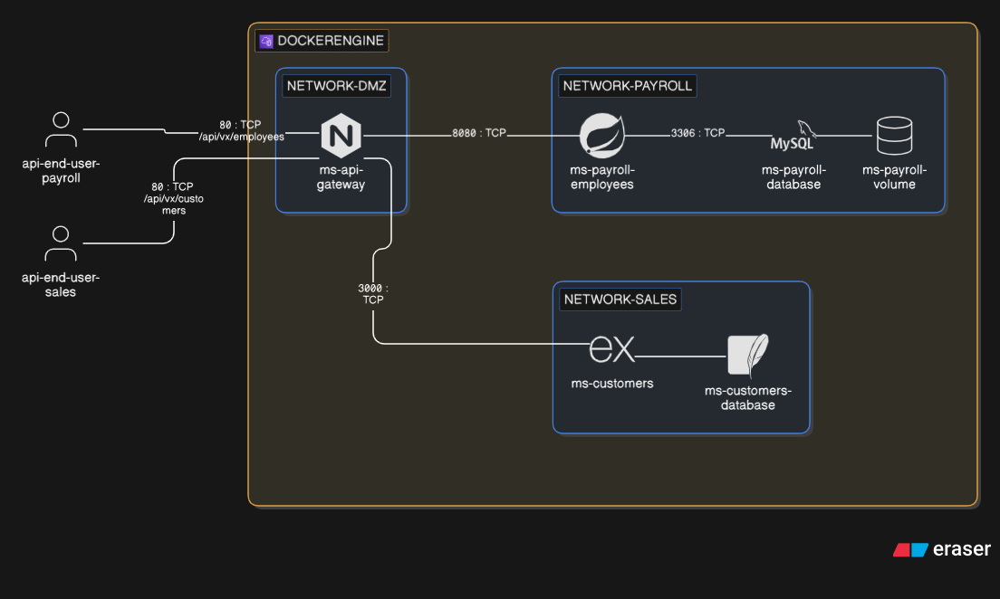

# Project

## Introduction

This project is dedicated to learning how to deploy a microservices-type application, involving an API gateway, various business microservices, and an isolated database on a third party.

Here is a visual representation of the infrastructure:



---


### BACKLOG

*Step 01 - Customers*

* Update project folder structure
* [Get microservice](https://etml-es-devops.s3.eu-west-1.amazonaws.com/customers.zip)
* Update Docker compose and nginx.conf
* Test the new service

```
curl -X GET localhost:8080/api/v1/customers
```

```
//expected result

```


## How to deploy the app


### Clone the repository

To set up the project locally, please create a private fork. In other words, do it without using the GitHub interface.

Start by cloning your repository locally, then add an upstream pointing to my repository.

```
//expected result
origin  https://github.com/CPNV-ES-VIR1/<yourRepo>.git (fetch)
origin  https://github.com/CPNV-ES-VIR1/<yourRepo>.git (push)
upstream  https://github.com/CPNV-ES-VIR1/<teacherRepo>.git (fetch)
upstream  https://github.com/CPNV-ES-VIR1/<teacherRepo>.git (push)
```

### Set env variable

Copy, paste and rename the sample.env in .env and update the value as expected.

### Normal operation

* Create all images

```dockerfile
docker compose build
```

Note : The initial build may take several minutes !

```bash
// expected result
[+] build 2/2
 ✔ Image payroll-start-point-ms-payroll-employees Built  2.7s
 ✔ Image payroll-start-point-ms-api-gateway       Built  2.7s  
```

```bash
//docker images
IMAGE                                        ID             DISK USAGE   CONTENT SIZE   EXTRA
payroll-start-point-ms-api-gateway:latest         4d334a02816c       92.6MB           26MB        
payroll-start-point-ms-payroll-employees:latest   41224f2db2f7        472MB          141MB      
```

* Start the infra

```dockerfile
docker compose up -d
```

```
//expected result
[+] up 20/20
 ✔ Image mysql:8.0                               Pulled                                                    20.1s
 ✔ Network payroll-start-point_dmz               Created                                                    0.1s
 ✔ Network payroll-start-point_payroll           Created                                                    0.0s
 ✔ Volume payroll-start-point_mysql-payroll-data Created                                                                                                                            0.0s
 ✔ Container ms-payroll-database                 Healthy                                                                                                                           16.5s
 ✔ Container ms-payroll-employees                Healthy                                                   27.1s
 ✔ Container ms-api-gateway                      Started   27.3s
```

```
//expected container state
//docker ps -a
[...]
CONTAINER ID   IMAGE                                 COMMAND                  CREATED         STATUS                   PORTS                                 NAMES
f112c5fbbf71   payroll-start-point-ms-api-gateway         "/docker-entrypoint.…"   2 minutes ago    Up About a minute (healthy)   0.0.0.0:80->80/tcp, [::]:80->80/tcp   ms-api-gateway
b7c5c6abd84c   payroll-start-point-ms-payroll-employees   "java -jar app.jar"      2 minutes ago    Up 2 minutes (healthy)        8080/tcp                              ms-payroll-employees
1ec90a70e27c   mysql:8.0                                  "docker-entrypoint.s…"   2 minutes ago    Up 2 minutes (healthy)        3306/tcp, 33060/tcp                   ms-payroll-database
680354997df7   moby/buildkit:buildx-stable-1              "/usr/bin/buildkitd-…"   10 minutes ago   Up 10 minutes                                                       buildx_buildkit_laughing_shamir0
```

```
//expected network config
//docker network ls
[...]
c80bb585a829   bridge                        bridge    local
5124788c1d74   host                          host      local
a4203ef5e8cf   none                          null      local
813b01da0644   payroll-start-point_dmz       bridge    local
9c925e3cd630   payroll-start-point_payroll   bridge    local
```

```
//expected volume config
//docker volume ls
[...]
local     payroll_mysql-payroll-data
```

---

## How to test the app

* Get all employees (without employees in database)

```
curl -X GET localhost/api/v1/employees
```

```
//expected result (no employees)
[]
```

* Try to send a request to a microservice that is temporarily down

```
docker compose down ms-payroll-employees
```

```
[+] down 2/2
 ✔ Container ms-payroll-employees      Removed                    0.2s
 ! Network payroll-start-point_payroll Resource is still in use   0.0s 
```

```
curl -i -X GET localhost/api/v1/employees/
```

```
HTTP/1.1 503 Service Temporarily Unavailable
Server: nginx/1.29.4
Date: Fri, 02 Jan 2026 11:04:06 GMT
Content-Type: application/json
Content-Length: 51
Connection: keep-alive

{"error":"Service temporarily unavailable"}
```

* Try to use a http verb outside the application scope

```
curl -X OPTIONS localhost
```

```
<html>
<head><title>405 Not Allowed</title></head>
<body>
<center><h1>405 Not Allowed</h1></center>
<hr><center>nginx/1.29.4</center>
</body>
</html>
```

---

## Debug and analysis

###  BuildKit issue (Windows)

#### Symptom

```dockerfile
//issue when attempting to build the infra
NotFound: forwarding Ping: no such job <jobid>
```

#### Resolution

* Hard reset Docker build state

```
docker compose down --remove-orphans
docker builder prune -f
docker system prune -f
```

* Disable BuildKit state and retry

```
set DOCKER_BUILDKIT=0
docker compose build
docker compose up
```

### Check the composer log

```
docker compose logs -f <ms-name>
```

### Build only one microservice

```
docker compose build <microservice-name>
```

### How to test the database connectivity

* Try from a payroll microservice

```
docker exec -it <microservice-name> sh
apt update
apt install -y mysql-client
mysql -h <microservice-name hosting mysql> -u <username> -p<passwd> <database>
```

### How to check manually the health check

* For the api gateway

```
docker exec -it ms-payroll-api-gateway curl http://localhost/health
```

```
curl http://localhost/health
```

```
//result expected
OK
```

* For the business microservices

```
docker exec -it ms-payroll-employees curl http://localhost:8080/actuator/health
```

```
curl http://localhost:8080/actuator/health
```

```
//result expected
{"status":"UP","groups":["liveness","readiness"]}
```
